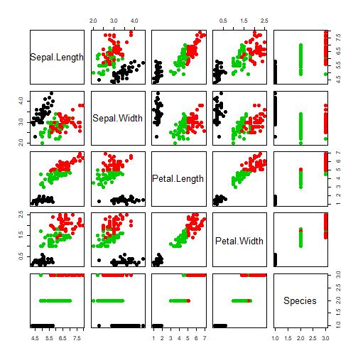

Course Project: K-Means Clustering Application
========================================================
author: Raunak Shakya
date: November, 2018
autosize: true

http://rpubs.com/raunakshakya707/440550

Introduction
========================================================

In the k-means clustering algorithm, the data are clustered by the k-means method, which aims to partition the points into k groups such that the sum of squares from points to the assigned cluster centres is minimized. At the minimum, all cluster centres are at the mean of their Voronoi sets (the set of data points which are nearest to the cluster centre).

This application has been developed as part of the Coursera's Developing Data Products Course Project: Shiny Application and Reproducible Pitch. It allows you to perform k-means clustering for diffrrent dimensions of three preloaded datasets namely, iris, mtcars and quakes. The scatterplot is displayed in the main panel along the structure of the dataset. We can also input the number of clusters and the maximum number of iterations.

How to use the application
========================================================

First, choose a dataset from the select dropdown, then select any of the x and y variables of that dataset, required number of centers and iterations. The plot is dynamically updated whenever the input to the k-means algorithm is changed.

The application is deployed on shinyapp.io and here is the link to the application:
https://raunakshakya707.shinyapps.io/developing-data-products-week-4/

The server.R and ui.R code can be accessed on the github repository. Given below is the link to repository:
https://github.com/XavierFontane/Course-Project-Shiny-Application-and-Reproducible-Pitch/

Code
========================================================


```r
iris_kmeans <- kmeans(iris[3:4], centers=3, iter.max=10)
iris_kmeans
```

```
K-means clustering with 3 clusters of sizes 50, 46, 54

Cluster means:
  Petal.Length Petal.Width
1     1.462000    0.246000
2     5.626087    2.047826
3     4.292593    1.359259

Clustering vector:
  [1] 1 1 1 1 1 1 1 1 1 1 1 1 1 1 1 1 1 1 1 1 1 1 1 1 1 1 1 1 1 1 1 1 1 1 1
 [36] 1 1 1 1 1 1 1 1 1 1 1 1 1 1 1 3 3 3 3 3 3 3 3 3 3 3 3 3 3 3 3 3 3 3 3
 [71] 3 3 3 3 3 3 3 2 3 3 3 3 3 2 3 3 3 3 3 3 3 3 3 3 3 3 3 3 3 3 2 2 2 2 2
[106] 2 3 2 2 2 2 2 2 2 2 2 2 2 2 3 2 2 2 3 2 2 3 3 2 2 2 2 2 2 2 2 2 2 3 2
[141] 2 2 2 2 2 2 2 2 2 2

Within cluster sum of squares by cluster:
[1]  2.02200 15.16348 14.22741
 (between_SS / total_SS =  94.3 %)

Available components:

[1] "cluster"      "centers"      "totss"        "withinss"    
[5] "tot.withinss" "betweenss"    "size"         "iter"        
[9] "ifault"      
```

Plot
========================================================


```r
plot(iris, col = iris_kmeans$cluster, pch = 20, cex = 2)
points(iris_kmeans$centers, pch = 8, cex = 2, lwd = 2)
```



Link to the deployed application
========================================================

https://raunakshakya707.shinyapps.io/developing-data-products-week-4/
